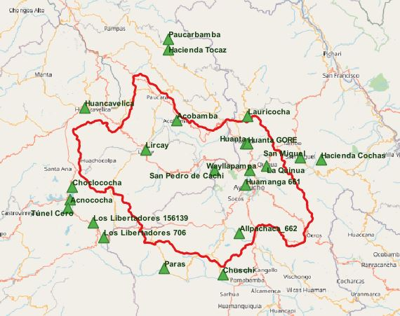

# **aedR: Análisis exploratorio de datos en R**

## Introducción

AedR es una librería que contiene algunas herramientas gráficas y de resumen estadístico para realizar análisis exploratorio de datos.

## Instalación

Para instalar la librería **aedR**, escriba las siguientes instrucciones en la consola de R:
```	
> library(devtools)
> install_github("GeomarPerales/aedR")		
```

## Contenido

Algunas de las técnicas de exploración de datos son:
datos de 22 estaciones del Perú y series mensuales históricas de precipitación correspondientes a cada estación, 

* Diagrama de cajas
* Series de tiempo
* Resumen estadístico: minimo, 1° cuartil, fecha del máximo, 3° cuartil, máximo.
* Información no disponible
* Información de datos dudosos (outliers).

## Datos

AedR cuenta con dos conjuntos de datos: un marco de datos de 22 series históricas de mensuales y otro de estaciones correspondientes a las series históricas mensuales. Los datos fueron descargados de la red de estaciones del SENAMHI y mensualizados.

Las estaciones corresponden a la zona de estudio de la cuenca Huarpa, ubicada entre los departamentos de Ayacucho y Huancavelica, en Perú.


La red de estaciones utilizada fue recolectada de la web del SENAMHI y ANA.


<p align="center">
  
</p>


## Referencias

* Pathak, M. (2014). Beginning Data Science with R.
* Zumel, N., Mount, J. (2014). Practical Data Science with R.

 
